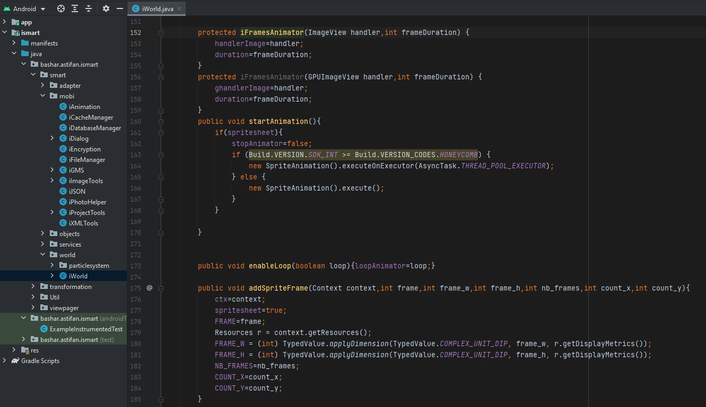

   
  <b>iSmart Android Library, Used in the game below</b> 
  <a href="./src">Source</a> |
  <a href="https://play.google.com/store/apps/details?id=bashar.astifan.xochallenge">XO Challenge Game(Link Soon)</a> 
    
    

I made this library long time ago (between 2013 until 2016)

It will help to make coding easier for Android

I didn't maintain this library since 2017 so some function might be deperacted

Feel free to use it or change it if you want.

# Features

- List adapter solutions
- Mobile helpers (Dialogs, Image Tools..etc)
- HTTP helpers
- iWorld (base idea)

# iWorld

This was an idea to build graphic solutions 

So the developer can use advanced effects without using graphic libraries

And make the graphic element available inside the activity

You will find SpriteAnimation and Audio manager already done and tested

# Credits

Created by Bashar Astifan